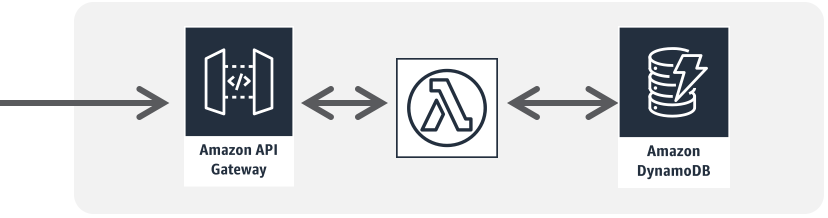
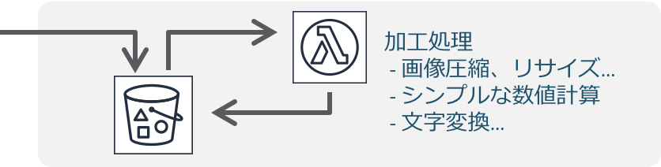
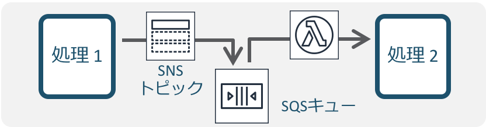

# FaaSにおける設定不備と脆弱性の悪用
## 概要
本稿では、ウェブやモバイルのアプリケーションで利用されるプログラムの実行を行うサービスである、FaaSの活用と、実装や利用方法が起因となるアプリケーションの脆弱性について解説を行います。

## FaaSとは
FaaS(Function as a Service)は、サーバーレスなアプリケーションやマイクロサービスで用いられるサービスで、一定の制約下でプログラムを実行を実行可能にする、IaaSやPaaSのようにクラウド上で利用可能なコンピュータリソースを提供するサービス形態の一つです。

このFaaSは多くのクラウドベンダーで提供されており、私たちは気づかないうちにこれらサービスと向き合っているかもしれません。

- [AWS Lambda](https://aws.amazon.com/jp/lambda/)
- [Google Cloud Functions](https://cloud.google.com/functions?hl=ja)
- [Azure Functions](https://azure.microsoft.com/ja-jp/products/functions/)
- [Cloudflare Workers](https://www.cloudflare.com/ja-jp/products/workers/)
- [Netlify Functions](https://www.netlify.com/products/functions/)

FaaSの特徴として、あるイベントをトリガーにLambdaにホストされたプログラムが実行されることが挙げられます。下記に簡単な例

例: Amazon Web Service Japan [形で考えるサーバーレス設計](https://aws.amazon.com/jp/serverless/patterns/serverless-pattern/)より

**API Gateway + Lambda + DynamoDBを用いたAPI** 
APIをサーバーレスで構築する際の基本パターンで、API Gatewayへのリクエストをトリガーに実行されます。

**S3にアップロード時に画像を加工するためのLambda** 
S3 Bucketに画像やファイルをアップロードしたイベントをトリガーにLambdaを実行するデザインパターンです。

**SNS + SQS(Queue) + Lambdaを用いた業務処理** 
各種重要処理や競合/重複状態を回避するために利用されるデザインパターンで、SNSのPubSub機能を用いて、SQSに投入し、LambdaがそのイベントをもとにQueueに入ったデータを取得し実行されます。

## 脆弱性 / 脅威 / 悪用

- [環境変数への認証情報の格納](./storing_credentials_in_environment_variables.md)
- [設定ミスによるDoS](./misconfiguration_dos.md)
- [エラー情報の開示](./disclosure_of_error_information.md)