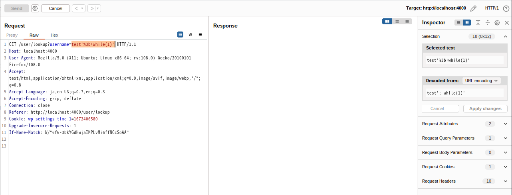
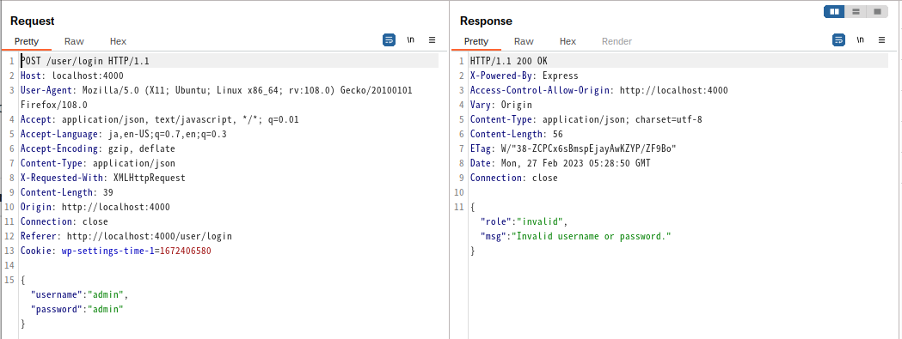
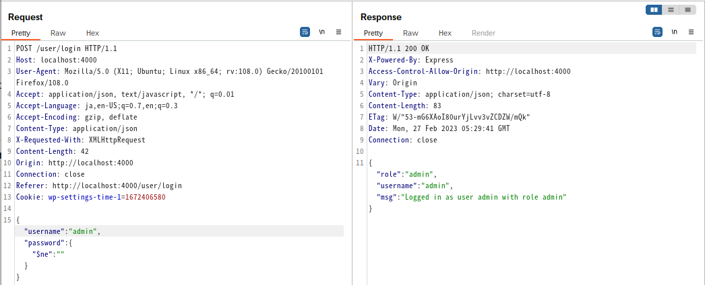
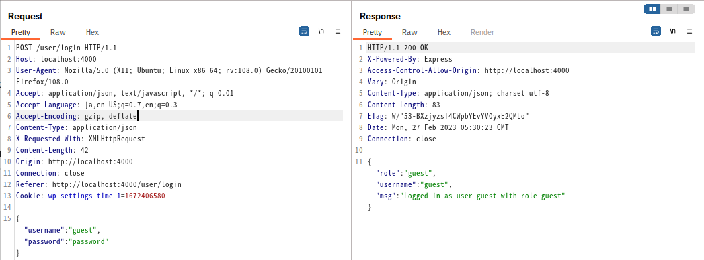
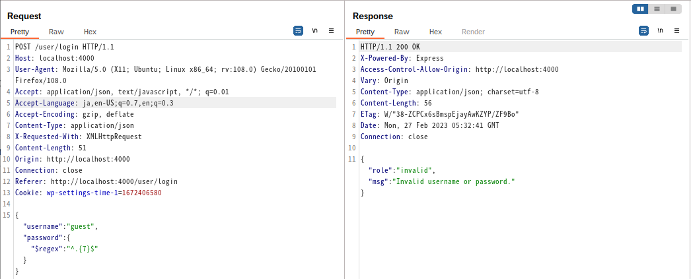
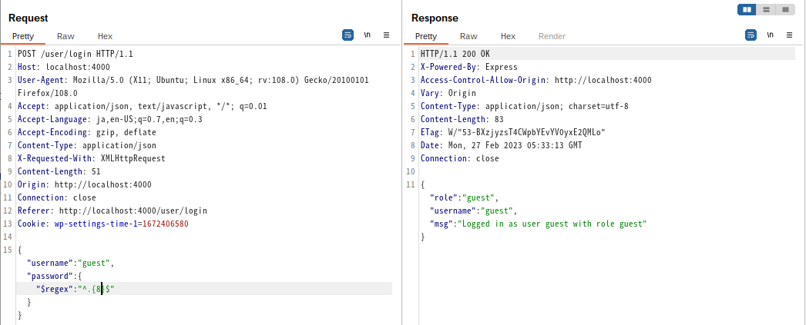

# NoSQL Injection
## 概要
NoSQLデータベースを利用したWebアプリケーションにおける脆弱性の事です。
NoSQLはより柔軟なデータ形式を使用する、SQLを利用しないデータベースシステムを指します。一般的にデータを以下の4つに管理します。
key-value型、列指向型、グラフ型、ドキュメント型の4つです。

## 原因
NoSQLデータベースは、SQLデータベースとは異なり、クエリを実行する際にデータを構造化された形式で保存する必要がないため、従来のSQL Injectionとは異なる形で攻撃が発生します。こういったことが起こる原因として、以下のようなものが考えられます。  

- 不十分な入力値の検証
- クエリの構築における不適切な処理
- データベースの設定不備

# NoSQL Injectionが及ぼす影響
攻撃者はパラメータを改ざんし、データベースに意図しない挙動をさせることができます。
また、使用するnosqlの種類によっては任意のJavaScriptを実行される可能性もあります。
よって、アプリケーションの機密性、整合性、可用性を損ないます。

# 事例紹介

## CVE-2021-22911
Rocket Chatで見つかったNoSQLInjectionです。
getPasswordPolicy関数で、NoSQL Injectionが実行できます。
認証/認可を必要とせずに、パスワードリセットトークンを流出させることで、アカウントの乗っ取りが可能でした。
管理者アカウントを乗っ取ることで、RCEにつなげることも可能だったようです。  
ref : https://www.cve.org/CVERecord?id=CVE-2021-22911

## CVE-2021-20736
GROWI 日本製のOSSで見つかったNoSQL Injectionです。
Gitの編集ログをみるに、アクセストークンパーサにNoSQL Injectionがありました。  
ref : https://weseek.co.jp/ja/news/2021/06/14/growi-nosql-ingection/  
ref : [JVN#95457785](https://jvn.jp/jp/JVN95457785/index.html)

##  CVE-2020-35666
Software : Steedos Low Code DevOps Platformで見つかったNoSQL Injectionです。  
ポストされるパラメータを、`X-User-Id[$ne]=1`のように書き換える事で、攻撃が実行されます。  
ref : https://github.com/steedos/steedos-platform/issues/1245

# 診断観点
## SSJIとは
SSJIは、Server Side JavaScript Injectionが正式名称となっています。これは、JavaScript実行の不適切な設定などによって、攻撃者から送信された不正なJavaScriptコードが、サーバサイド側にて実行されてしまう攻撃手法のことです。  

## Mongo
以降は脆弱なアプリケーションを利用して、それぞれの攻撃を確認します。
### Mongo SSJI
Mongo SSJIについて、DoS攻撃を例に説明します。
MongoDBは、スクリプト言語としてJavaScriptを使うことができます。脆弱なアプリで、`$where`演算子を利用している箇所に対して`test'; while(1)'`を送信します。
すると、無限ループのJavaScriptのコードが実行され、レスポンスが返ってこないことを確認できます。  
  
### 否定演算子の挿入
否定演算子を挿入について、ログインバイパスを例に説明します。  
正常なリクエストとして、適当な値、`{"username":"admin","password":"admin"}`を送信します。適当な値を送信しているので、ログインに失敗していることが確認できます。  
  

次に、このサイトに対して`{"username":"admin","password":{"$ne":""}}`を送信します。すると、ログインに成功します。  
  

MongoDBでは、`$ne`を否定演算子として扱います。この、否定演算子を挿入します。  
PHPなどの言語の仕様である組込みの連想配列処理が悪用され、以下のような配列に変換されます。
```
array("user" => array("$ne" => "admin"), "pass" => array("$ne" => "pass"));
```
上記の値が処理されることで、ユーザー名の部分は`user != 'admin'`、パスワードの部分は`pass != 'pass'` となります。よって、指定した値以外のすべてのユーザーにマッチするのでログインできてしまいます。また、指定した値が存在しなかった場合は登録ユーザ全員がマッチします。

### Blind NoSQL Injection
`$regex`演算子を利用したパスワードの文字数推測を例に説明します。  
まず、ユーザネームが`guest`,パスワードは`password`というアカウントがあります。  
ここで、`{"username":"guest","password":"password"}`を送信すると、ログインに成功します。  
  
<!-- textlint-disable -->
次に、このパスワードの長さを推測するために`$regex`演算子を用いた、`{"username":"guest","password":{"$regex":"^.{7}$"}}`と、`{"username":"guest","password":{"$regex":"^.{8}$"}}`をそれぞれ送信してみます。
<!-- textlint-disable -->
7文字推測  
  
8文字推測  
  
すると、パスワードの長さが8文字と推測したリクエストにてログインが成功していることが分かります。実際にパスワードである文字列`password`は8文字で、パスワードの文字列の長さが推測できます。今回は文字数を推測しましたが、同様に正規表現を用い、文字種を次々と入れレスポンスの差分をみることで、パスワードの文字列そのものを線形探索するといったこともできます。

## Redis

### 意図しないデータの挿入
Nodeでの例を説明します。広く使われているqsモジュールは、クエリ文字列にオブジェクトや配列をパラメータとして渡すことができます。Expressのような一般的なフレームワークでは、このモジュールがデフォルトで有効になっています。このような場合、渡された値によっては、後続のすべてのパラメータを上書きできる可能性があります。その結果、意図しない値がkey-valueペアとして格納されることで、意図しないデータを登録されてしまう事が考えられます。

####  jsonからの受け取りで挿入
以下のようなjsonで値を受け取るコードがあったとします。
```
app.use(bodyParser.json());

app.post('/', function (req, res) {  
    redis.set(req.query.key, "default");
});
```

`{key : "foo"}`を送信すると、以下が実行されます。  

```
redis.set("foo", "default");
```
ここで、`{key : ["foo", "evil"]}`といったリクエストを送信します。すると、 以下のように実行され、本来入れようとしていた末尾の`default`が削られてしまいます。
```
redis.set(["foo", "evil"], "default");
```

####  クエリ文字列からの挿入
以下のようにクエリ文字列で値を受け取るコードがあったとします。
```
app.post('/', function (req, res) {  
    redis.set(req.query.key, "default");
});
```
`?key=foo`を送信すると、以下が実行されます。
```
redis.set("foo", "default"); 
```
ここで、`?key[]=foo&key[]=evil`といったリクエストを送信します。すると、上記と同様に本来入れようとしていた末尾の`default`が削られてしまいます。
```
redis.set(["foo", "evil"], "default");
```

# 対策

## MongoDB
- 最新バージョンを使用
- 入力検証・サニタイズライブラリの仕様  
    -  `mongo-sanitize`、`mongoose`
- MongoDBにおいては、 `where`、`mapReduce`、 `group`演算子を使用しないようにしましょう。これらの関数は攻撃者が任意のJavaScriptを注入できてしまう可能性があります。また、可能であれば`mongod.conf`に以下のように設定しましょう。
```
javascriptEnabled:false
```
- 必要最低限の権限を付与する

## Redis 意図しないデータの挿入
対策として、渡されたパラメータを正しく受け取るように実装しましょう。  

# 補足資料
- DynamoDB  
    - [DynamoDB Injection. I have been developing a bunch of… | by Abhay Bhargav | AppSecEngineer | Medium](https://medium.com/appsecengineer/dynamodb-injection-1db99c2454ac)
- couchdb
    - [NOSQL INJECTION](https://owasp.org/www-pdf-archive/GOD16-NOSQL.pdf)
<!-- textlint-disable -->
- memcached
    - [The New Page of Injections Book: Memcached Injections](https://www.blackhat.com/docs/us-14/materials/us-14-Novikov-The-New-Page-Of-Injections-Book-Memcached-Injections-WP.pdf)
    - [A small injection for memcached – HackMag](https://hackmag.com/security/a-small-injection-for-memcached/)
<!-- textlint-disable -->
- Cassandra
    - [br3akp0int: CASSANDRA AND CQL INJECTIONS](https://br3akp0int.blogspot.com/2019/11/cassandra-and-cql-injections.html)

# 参考資料
- [NoSQL Injection > Redis](https://medium.com/@PatrickSpiegel/https-medium-com-patrickspiegel-nosql-injection-redis-25b332d09e58)
- [NoSQL Injection > Redis. Ever considered injection a problem for… | by Patrick Spiegel | Medium](https://medium.com/@PatrickSpiegel/https-medium-com-patrickspiegel-nosql-injection-redis-25b332d09e58)


# 補助ツール紹介
- [NoSQLi Scanner - PortSwigger](https://portswigger.net/bappstore/605a859f0a814f0cbbdce92bc64233b4)
- [GitHub - codingo/NoSQLMap: Automated NoSQL database enumeration and web application exploitation tool.](https://github.com/codingo/NoSQLMap)
- [GitHub - digininja/nosqlilab: A lab for playing with NoSQL Injection](https://github.com/digininja/nosqlilab)
- ペイロードリスト  
    - [NoSQL injection - HackTricks](https://book.hacktricks.xyz/pentesting-web/nosql-injection)
