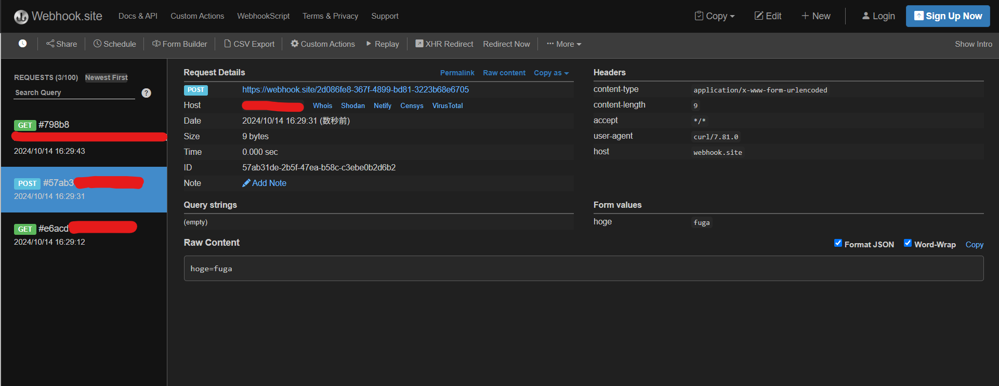

# SSRF
## 概要
SSRF（Server-Side Request Forgery）とは、アプリケーションの他サーバーにアクセスする機能を悪用して、設計者が意図していないリソースへアクセスすることが可能となる攻撃手法です。

## 影響

### 内部リソースの取得
外部からはアクセスができないが、この脆弱性があるアプリケーションサーバーからはアクセスできるようなリソース（例えば、組織内部のネットワークのみに公開されているWebサイト等）が存在する場合、攻撃者はこの脆弱性を悪用して情報窃取が可能です。

### レスポンスを取得できない場合の影響
SSRFの中には、脆弱性の特性によってレスポンスを読み取ることができないケースがあります。このような種類のSSRFはBlind SSRFとよばれ、下記のような影響が考えられます。

- レスポンス時間の違いによる内部ネットワーク上のホストやポートの探索
- バージョンが古いWebアプリケーションの特定のエンドポイントや脆弱性を悪用した情報窃取やRCE（[参考](https://github.com/assetnote/blind-ssrf-chain)）

### AWS上における影響
AWS上においては、IMDSv2をOptionalに設定した状態のEC2インスタンス上に存在するSSRFが悪用された場合、インスタンスにアタッチされたIAMロールのクレデンシャルをGETリクエストのみで窃取できます。

詳細は[Webアプリケーションの脆弱性を利用した認証情報の窃取](https://webapppentestguidelines.github.io/newtechtestdoc/docs/cloudsec/cloud_credential/)を参照してください。

## 原因
ユーザーから指定されたURLにアクセスするようなアプリケーション機能を実装する場合に、取得できるリソースに適切な制限をかけていない場合に発生します。

SSRFとなりうる処理の例としては次のものが挙げられます。
- Webhook機能
- OGPで指定された画像の取得機能
- リンク先ページの記事プレビュー機能
- XMLのパース処理によるXML外部実体参照

## 攻撃手法
ユーザーが指定したURLへのアクセスをするアプリケーションの例として、SNSの投稿に含まれるURLのリンク先のページのプレビュー機能を考えます。

プレビュー機能のイメージ：


このような機能において、例えば、攻撃者は `http://10.0.0.1` といったURLを含めて投稿を送信します。

この `10.0.0.1` はプライベートIPであるため、インターネット上から該当するサーバーへアクセスすることはできません。しかし、仮にこのサーバーから `10.0.0.1` のIPアドレスが割り当てられた内部のサーバーへアクセスでき、かつ、なんらかのHTTPサービスが稼働している場合には、プレビュー機能を通じてこのサーバーからのレスポンスの内容を閲覧できてしまいます。

### 他プロトコルを利用した場合の攻撃手法

使用するHTTPクライアントによっては `http://` や `https://` 以外のURLスキーマに対応しています。これらのURLスキーマを利用することで例えば下記のような攻撃が可能です。

- `gopher://` : Redisサーバーへのコマンド送信によるファイル書き込みおよびリモートコード実行（例： `gopher://127.0.0.1:6379/_%0D%0AINFO%0D%0Aquit%0D%0A`)
- `file://` : サーバー上のファイル読み取り（例： `file:///etc/passwd`）

### 対策を迂回する攻撃手法
上記の対策として、ユーザーから送信されたURLのチェックをし、外部からはアクセスできないサーバーがアクセス先の場合に、リクエストを送信しないようにする実装が考えられます。

しかし、このような実装においては次のように対策を迂回する攻撃手法に注意して実装をする必要があります。　


#### プライベートIPアドレスへ名前解決するドメイン名の使用

攻撃者は自身の所有するドメインのレコードにプライベートIPを設定します。

例えば、次のドメインは `127.0.0.1` に名前解決がされます。
- `127.0.0.1.nip.io`

このようなドメイン名がホスト名となるURLを指定することで、名前解決先のIPアドレスチェックが不十分な対策を迂回できます。

#### 一般的でないIPアドレス表現の利用
`127.0.0.1` と同じ接続先となるIPアドレスの表現には次のようなものがあります。
- `0.0.0.0`
- `2130706433`
- `017700000001`
- `127.1`

これらのIPアドレスをURLのホスト部分に指定することで、IPアドレスの正規化を実施せずにIPアドレスの検証を行っている対策を迂回できます。

#### ホスト部分のパース不備

`http://hoge@127.0.0.1/` といったURLは `127.0.0.1` に対してリクエストを送信しますが、ホスト名部分の抽出が正しく行われない場合に、間違ったホスト名に対する検証が行われ、検証を迂回できます。

#### リダイレクトするURLの指定
攻撃者は `http://127.0.0.1/` へリダイレクトするようなHTTPレスポンスを返すエンドポイントを用意します。例えばPHPの場合には次のようなコードでリダイレクトするレスポンスを返却することができます。

```php
<?php
$redirect_url = 'http://127.0.0.1/';
header('Location: ' . $redirect_url, true, 302);
exit();
?>
```

このエンドポイントのURLを指定することで、記事のプレビュー取得の際にリダイレクト先のチェックを行っていないケースを迂回できます。

#### DNS Rebinding
URLで指定されているホスト名がプライベートIPへ名前解決が行われるかどうかをチェックした後に、指定したURLへアクセスする実装が考えられます。

例えば次のような実装です。

```go
// 引数のIPがプライベートIPアドレスかどうかを判定する関数
func isPrivateIP(ip net.IP) bool {
	return ip.IsPrivate() || ip.IsLoopback() || ip.IsLinkLocalUnicast()
}

// 指定されたURLからHTTPのレスポンスを取得する関数
func fetchCheckedURL(targetURL string) (*http.Response, error) {
	parsedURL, err := url.Parse(targetURL)
	if err != nil {
		return nil, err
	}

	hostname := parsedURL.Hostname()
	ip := net.ParseIP(hostname) // ホスト名がIPアドレス形式かチェック
	if ip != nil {
 		// IP直接指定の場合（例: http://1.1.1.1）
		if isPrivateIP(ip) {
			return nil, errors.New("access to private IP address is forbidden")
		}
	} else {
 		// ホスト名指定の場合（例： http://example.com）
 		// 1. 名前解決を実行
		ips, err := net.LookupIP(hostname)
		if err != nil {
			return nil, err
		}
		if len(ips) == 0 {
			return nil, fmt.Errorf("no IPs found for hostname %s", hostname)
		}

 		// 2. 名前解決後のIPアドレスがプライベートIPになっていないかどうかを判定
		for _, resolvedIP := range ips {
			if isPrivateIP(resolvedIP) {
				return nil, fmt.Errorf("hostname %s resolves to a forbidden IP: %s", hostname, resolvedIP.String())
			}
		}
	}

    // 3. チェックを通過したらURLへアクセス
    // 省略
    resp, err := client.Get(targetURL)
    // 省略
}
```

このような実装の場合に、チェック対象のIPアドレス（1. 名前解決を実行）と実際にアクセスを行うIPアドレス(3. チェックを通過したらURLへアクセス)が異なるケースが出てきてしまいます。

これを利用して、攻撃者は自身の所有するドメインの権威サーバーを細工し、名前解決のレスポンスのTTLを0に設定した上で、リクエストのたびに名前解決先のIPアドレスを変更します。
これにより、チェック対象のIPアドレスと実際にアクセスを行うIPアドレスを異なるものにし、このチェックを迂回することができます。


ここで利用可能なツール等は、「Singularity を利用したDNS Rebindingの診断」にて紹介します。

## 対策
### アプリケーションレイヤーでの対策

#### ホワイトリストによるURLのチェック
ユーザーが入力可能なURLのホスト名やパスなどが限定されている場合、パースしたURLに対してホワイトリストベースでのチェックを行うことが可能です。

```js
function checkUrl(inputUrl) {
  const allowedHosts = [
    'hoge.example',
    'example.com'
  ];
  const allowedSchemes = ['http:', 'https:'];

  try {
    const parsedUrl = new URL(inputUrl);
    const hostname = parsedUrl.hostname;
    const protocol = parsedUrl.protocol;
    return allowedSchemes.includes(protocol) && allowedHosts.includes(hostname);
  } catch (error) {
    return false;
  }
}
```

しかし、SNS上で投稿されるURLのプレビュー機能など、URLで指定されるホスト名などが特定できない場合には、この手法を使うことができないため、次に述べるような対策が必要です。

#### URLスキームの制限
URLをパースしてスキームを `http://` や `https://` のみに制限します。これにより、 `gopher://` や `file://` スキームなどの意図しないリソースへのアクセスを防ぐことができます。

#### IPアドレスのチェック
アプリケーションがURLで指定されたホストへリクエスト送信する際に、DNSの名前解決処理に介入し、名前解決先のIPアドレスが外部からの接続ができないものかどうかをチェックします。

例えば、Go言語では次のように実装できます。

```go
func isPrivateIP(ip net.IP) bool {
	return ip.IsPrivate() || ip.IsLoopback() || ip.IsLinkLocalUnicast()
}

// プライベートIPへの接続をブロックするカスタムDialContext
func safeDialContext(ctx context.Context, network, addr string) (net.Conn, error) {
	host, port, err := net.SplitHostPort(addr)
	if err != nil {
		return nil, err
	}

	// ホスト名が既にIPアドレス形式の場合 (HTTP Clientが解決済みの可能性)
	ip := net.ParseIP(host)
	if ip != nil {
		if isPrivateIP(ip) {
			return nil, fmt.Errorf("connection to forbidden IP %s blocked", ip.String())
		}
	} else {
		// ホスト名の場合は解決
		resolver := net.DefaultResolver
		ipAddrs, err := resolver.LookupIPAddr(ctx, host)
		if err != nil {
			return nil, err
		}
		if len(ipAddrs) == 0 {
			return nil, fmt.Errorf("no IPs found for hostname %s", host)
		}

		// 解決されたIPがプライベートIPかどうかをチェック
		for _, ipAddr := range ipAddrs {
			ip := ipAddr.IP
			if isPrivateIP(ip) {
				return nil, fmt.Errorf("connection to forbidden resolved IP %s blocked", ip.String())
			}

			// チェックOKなIPで接続試行
			connAddr := net.JoinHostPort(ip.String(), port)
			conn, err := dialer.DialContext(ctx, network, connAddr)
			if err != nil {
				return conn, err
			}
            
            return conn, err
		}
		// 有効なIPへの接続が全て失敗した場合
		if firstErr == nil { // このケースは通常考えにくい (IPがないかブロックされているはず)
			return nil, errors.New("no connectable IP address found")
		}
		return nil, firstErr // 記録した最初のエラーを返す
	}

	// IP直指定で、チェックを通過した場合
	dialer := &net.Dialer{Timeout: 5 * time.Second}
	return dialer.DialContext(ctx, network, addr)
}

// 安全なDialContextを持つHTTPクライアントを作成
func createSafeHTTPClient() *http.Client {
	transport := &http.Transport{
		DialContext:           safeDialContext,
		TLSHandshakeTimeout:   10 * time.Second, // TLSタイムアウトは設定推奨
		ExpectContinueTimeout: 1 * time.Second,
	}
	return &http.Client{
		Transport: transport,
		Timeout:   15 * time.Second, // リクエスト全体のタイムアウト
	}
}
```

これにより、DNS Rebindingやリダイレクトを利用した回避手法に対して対策をすることができます。

#### DNS Pinning
DNS Rebinding攻撃対策のため、TTLが0の場合でもDNSの名前解決を一定期間キャッシュしておきます。アプリケーション内でDNSの名前解決を実施する際にはこのキャッシュを利用するように変更します。

### ネットワークレイヤーでの対策

#### ファイアウォールによる外向きの通信の制限
SSRFが起こり得るアプリケーションを実装しているサーバーの接続先をファイアウォールによって制限します。

#### プロキシの利用
HTTPやSOCKS5プロキシのような接続先を制限できるようなソフトウェアを利用します。

### AWSでの対策
AWS上のリソースのIMDSv2の設定を `Optional` から `Required` に変更することでIMDSv2へ移行します。

## 診断方法

「攻撃手法」の項で説明した内容を試行することで診断を実施します。下記のようなツールを活用することにより、攻撃の試行や脆弱性の有無を確認できます。

### Burp SuiteのCollaboratorの利用
Burp Suite ProfessionalではCollaboratorと呼ばれる機能が提供されています。（Community版では利用不可）この機能を利用することでHTTPやDNS、SMTPによる外部のサーバーへのリクエスト送信の発生を確認できます。

利用方法としては、まずBurp Suiteを起動し、上部のCollaboratorタブをクリックをして専用のドメインを払い出します。次に、このドメインに対してリクエストが送信されるようなURLを作成して、SSRFの脆弱性があるアプリケーションの入力として利用します。

例えば、アプリケーションにSSRFの脆弱性があり、このURLへのアクセスが発生する場合、次のように、DNSとHTTPSアクセスによるログが記録され、リクエスト元のサーバーや受信したリクエストの内容の詳細を確認できます。

### Webhook.siteの利用

webhook.siteはBurp SuiteのCollaboratorと同様に外部サーバーへのリクエスト送信を確認するためのツールとして利用できます。

https://webhook.site にアクセスすると即座に専用のURLやドメイン等が発行され、*Your unique URL*の部分に表示されます。このURLをSSRFの脆弱性があるアプリケーションの入力として利用することで、リクエストを送信するような処理が含まれるかどうかを判断できます。

webhook.siteがリクエストを受信した場合には、左側のREQUESTSに対象のURLに送信されたリクエストの一覧が表示され、項目を選択すると右側に送信されたリクエストの詳細が表示されます。




### Singularity を利用したDNS Rebindingの診断
DNS Rebindingに対して脆弱な実装になっているかどうかを検証するため、[Singularity](https://github.com/nccgroup/singularity)とよばれるツールが利用できます。
例えば `example.com` というドメイン名を所有している場合、次のようにセットアップを行います。

まず、外部から到達可能な公開IPアドレス（例： `203.0.113.1`）を持つサーバーを用意し、外部から53番ポートに対して疎通可能な状態にします。

次に、`example.com`のサブドメインが用意したサーバーのIPアドレスを指すようにAレコードを登録します。さらに別のサブドメインのNSレコードに対して、このAレコードで登録したサブドメインが値となるように登録します。例えば次のように2レコードを登録します。

|レコードタイプ|名前|値|
|-|-|-|
|A|rebinder|203.0.113.1|
|NS|dynamic|rebinder.example.com|

その後、Goを利用して`203.0.113.1`のIPアドレスを持つサーバー上でSingularityをビルドします。

```bash!
$ git clone https://github.com/nccgroup/singularity
$ cd singularity/cmd/singularity-server
$ go build
```

ビルド後、生成されたバイナリを下記のように実行します。

```bash!
$ sudo ./cmd/singularity-server/singularity-server
```

クライアントから例えば次のようなドメイン名で名前解決を実行します。すると、1回目は `192.168.11.1` 、2回目は `192.168.22.2` となり、解決先のIPアドレスが変化していることがわかります。
```
$ dig +short s-203.0.113.100-10.0.0.1-123456-fs-e.dynamic.example.com
203.0.113.100
$ dig +short s-203.0.113.100-10.0.0.1-123456-fs-e.dynamic.example.com
10.0.0.1
```

上記で指定したサブドメインは、 `s-<IPアドレス1>-<IPアドレス2>-<ランダム値>-<モード>-e` のような構造をしています。モード部分に指定できる値には次のようなものを指定でき、名前解決の挙動を制御できます。
- `fs`: 1回目の問い合わせは「IPアドレス1」、それ以降は「IPアドレス2」を名前解決
- `ma`: 「IPアドレス1」と「IPアドレス2」の両方を含む名前解決
- `rr`: 「IPアドレス1」と「IPアドレス2」を交互に名前解決
- `rd`: 「IPアドレス1」と「IPアドレス2」をランダムに名前解決

また、回数に依存する制御は「ランダム値」ごとにセッションを持つので、リセットしたい場合には「ランダム値」を変更します。

そのほか、詳細な利用方法は[SingularityのWikiページ](https://github.com/nccgroup/singularity/wiki)を確認してください。


## 学習方法/参考文献
- https://cheatsheetseries.owasp.org/cheatsheets/Server_Side_Request_Forgery_Prevention_Cheat_Sheet.html
- https://blog.tokumaru.org/2018/12/introduction-to-ssrf-server-side-request-forgery.html
- https://github.com/swisskyrepo/PayloadsAllTheThings/blob/master/Server%20Side%20Request%20Forgery/README.md
- https://github.com/nccgroup/singularity/wiki/Preventing-DNS-Rebinding-Attacksv