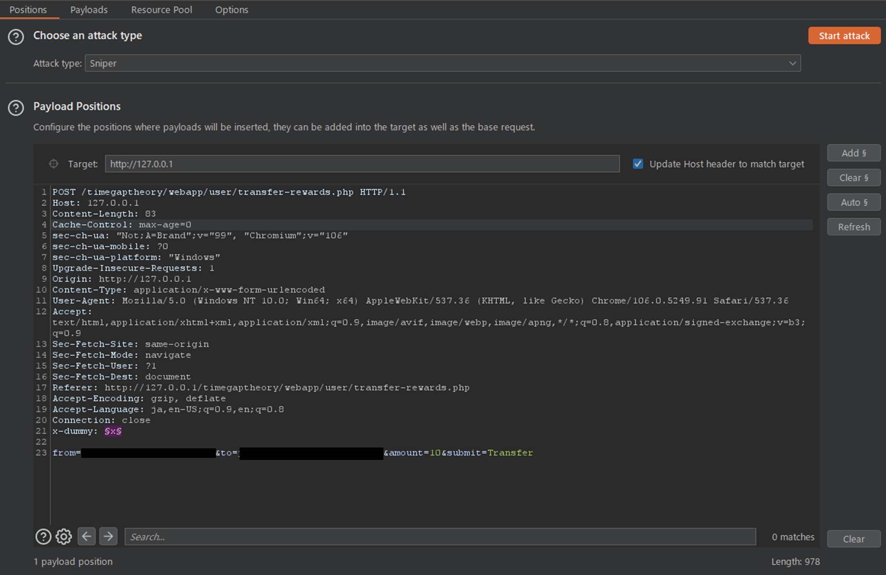
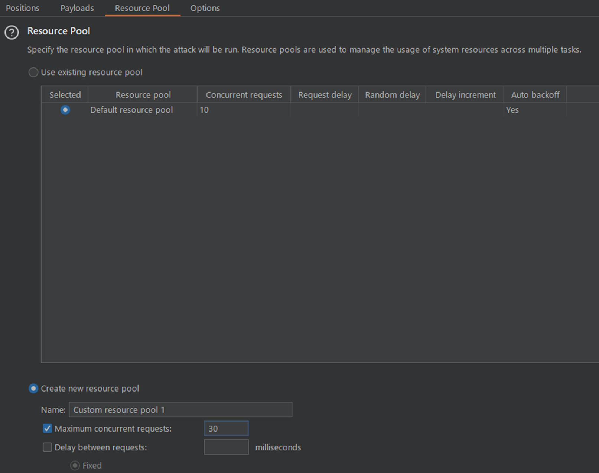
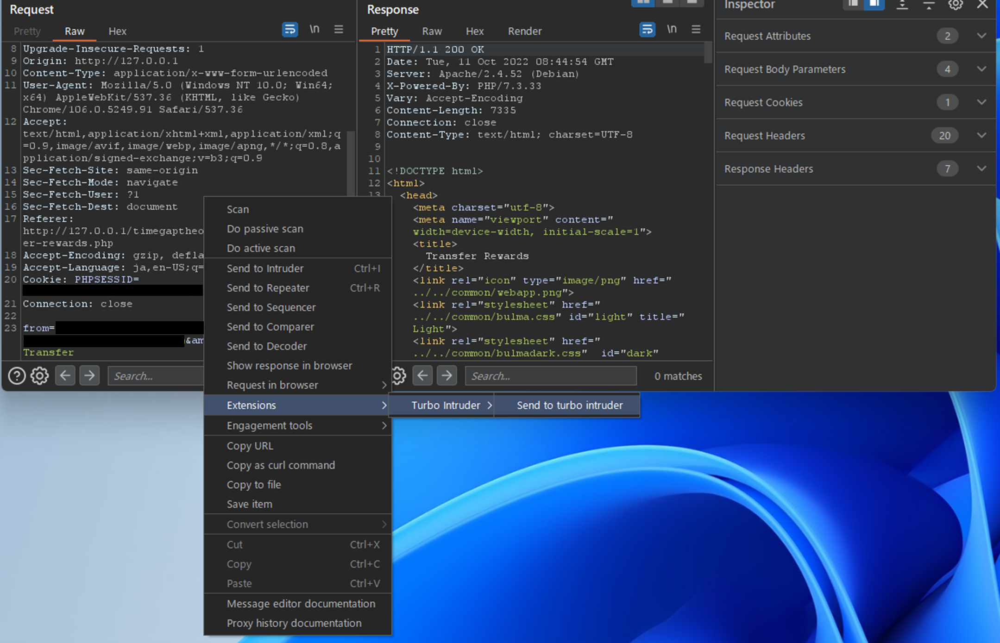
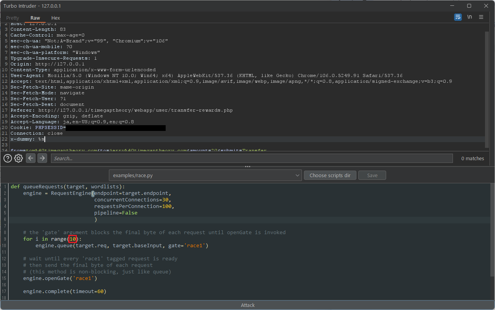

# TOCTOU/レースコンディション

## 概要

システム開発のセキュリティにおいてレースコンディションと TOCTOU は、しばしば混同して使われることがありますが、それぞれの違いについて用語の整理から確認していきましょう。

レースコンディション(Race Condition)とは、複数の処理が同じデータに対してアクセスしたときに、競合状態になることで想定外の処理が引き起こされる問題です。

対して TOCTOU(Time Of Check To Time Of Use)とは、あるデータの検証時点と使用時点での状態の差異によって想定外の処理が引き起こされる問題です。

つまりレースコンディションは、さまざまな競合状態の問題を表す包括的な脆弱性なのに対し、TOCTOU はより実装の状況を限定した具体的な脆弱性であることが分かります。

本章では、主に TOCTOU に関連する脆弱性や攻撃手法について説明します。

## 原因

TOCTOU は主にデータの検証と使用のタイミングが異なっていることに起因しています。

そのため、TOCTOU を対策する考え方としては、データのチェックと使用を同時に行い、処理の差を発生させないようにすることが理想的です。

## 影響

代表的な影響の例として、許可されていないデータへのアクセスやある操作の回数制限を超えた実行などが考えられます。
しかしながら、データの内容や重要性、アプリケーションの振る舞いといったビジネスロジックによって TOCTOU による影響範囲は大きく異なります。

ここでは TOCTOU が発生しやすい機能を例にあげます。

- 送金処理
- クーポンやキャンペーンコード等の発行や使用
- アカウントの新規登録
- 「高評価」や「いいね」などの投票機能

## 診断観点/攻撃手法

一般的に、DAST のようなツールを使用して TOCTOU の脆弱性を特定することは困難です。

これは、競合状態を引き起こした状態と正常な Web アプリケーションの振る舞いの違いを機械的に判断することは難しいためです。

また、TOCTOU の診断はミリ秒単位で調整されたリクエスト送信や単一の HTTP パイプライン内で複数の HTTP リクエストを送る診断が必要になります。そのため、Web アプリケーション診断に特化した専門ツール(Burp Suiteなど)が必要になります。  
このように、競合状態を起こすための条件や環境を整える必要がある性質上、他の Web アプリケーション脆弱性診断に比べて手動によるテストの難易度が高いと考えられています。

具体的には、実行回数に制限があるような機能や重複防止の制限が設けられている機能などで TOCTOU の診断が有用です。

### Burp Intruder を使用した診断

Burp に搭載されている機能の 1 つである Burp Intruder を使用して TOCTOU の診断を確認するパターンを紹介します。
なお、 Community Edition には機能制限があるため Pro Edition でしか診断できません。
Community Edition を使用する場合は、後述する Turbo Intruder を使用した診断方法をご覧ください。

始めに、送信したいリクエストを Burp Intruder にセットします。

Burp Intruder を開始するにはペイロードポジションを設定する必要がありますが、ペイロードによる作用を防ぎたいです。
そのため、ダミー用のリクエストヘッダ(`x-dummy`)を用意し、ダミー用ヘッダの値にペイロードポジションを設定します。

次に、ペイロードを設定します。

`Payload Type`を`Null payloads`に設定します。

Generate の空白欄に送信したいリクエスト数を入力します。

デフォルトでは同時に 10 リクエストを送信します。

より多くのリクエストを送信したい場合は、`Resource Pool`設定から新しいリソースプール設定を作成し、`Maximum concurrent requests`を設定してください。

### Turbo Intruder を使用した診断

Burp Suite の拡張機能として公開されている Trubo Intruder を使用したパターンを紹介します。

Turbo Intruder は、大量の HTTP リクエストを送信したり、Python を使用して柔軟にリクエスト前後の処理を操作できる拡張機能です。

また、Turbo Intruder は、標準の Burp Intruder とは異なり Community Edition でも使用できます。


**注意**  
Turbo Intruder は、Port Swigger 社のセキュリティリサーチャーである James Kettle 氏によって開発されています。しかし、十分なテストが行われていないため Burp の標準機能よりも信頼性がなく、システムパフォーマンスに影響を及ぼす可能性があるため、自己責任のもと拡張機能を使用してください。 


<!-- textlint-disable -->

送信したいリクエストを選択し、コンテキストメニューから`Extensions`->`Turbo Intruder`->`Send to turbo intruder`をクリックして、Turbo Intruder へリクエストを送ります。

<!-- textlint-disable -->

別のウィンドウが表示されます。

Turbo Intruder も Burp Intruder と同様にペイロードポジションを設定する必要があります。
ここではダミー用のリクエストヘッダ(`x-dummy`)を用意し、ダミー用ヘッダの値に%s をセットしてペイロードポジションを設定します。

次にドロップダウンリストから「`examples/race.py`」を選択します。

デフォルトでは同時に 30 リクエスト送信する設定になっています。
例として 10 リクエスト送信したい場合は、9 行目の`range`関数の引数を修正します。

## 事例紹介

- https://github.com/reddelexc/hackerone-reports/blob/master/tops_by_bug_type/TOPRACECONDITION.md

## 対策

データの整合性を保つ設計にする必要があります。しかしながら、Web アプリケーション毎に実装やデザインが異なるため、具体的な方法は多岐に分かれます。

- データのチェックからデータ更新までの一連の処理が完了するまで、ほかのスレッドやプロセスからアクセスできないようにしてください。
- データベースで管理している場合はトランザクションを行い、読み書きする情報にロックを掛ける実装にしてください。
  - ロックの範囲が広すぎると脆弱性の発生箇所とは異なる箇所でデッドロックが発生したり、トランザクション処理によってパフォーマンスにも影響を及ぼす可能性があるため注意してください。

## 学習方法/参考文献

- https://timegaptheory.com/index.html
