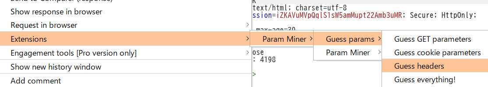
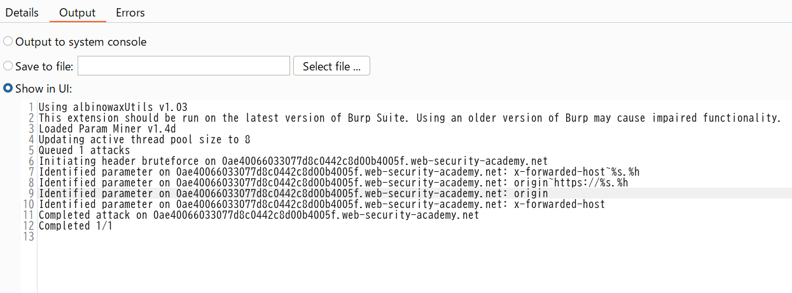
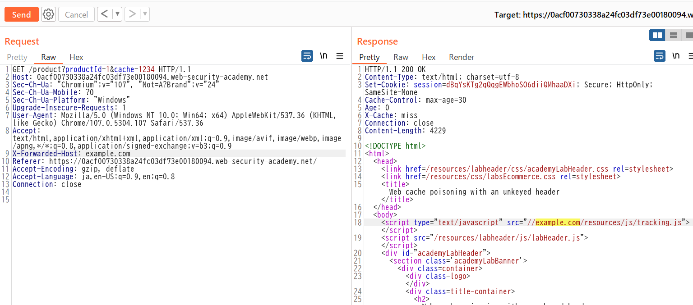
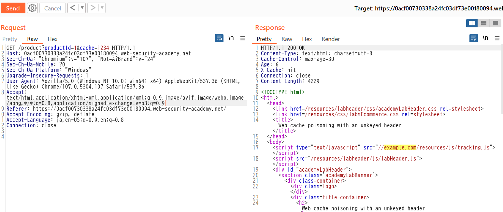

# Web Cache Poisoning
Web Cache Poisoning とは、Webサーバとキャッシュ(サーバ) の協調動作の欠陥を利用して、攻撃者が作成した悪意のあるレスポンスをキャッシュに注入する攻撃です。  
　Webにおけるキャッシュとは、Webサーバとクライアントの間に存在します。キャッシュは再利用可能なレスポンスがキャッシュサーバに存在し、クライアントがそれを要求した場合、Webサーバへリクエストを転送せずにキャッシュサーバからレスポンスをクライアントに転送します。キャッシュサーバの存在によってWebサーバへのリクエスト数を減らすことができ、Webサーバへの負荷を減らすことができる技術です。

## 影響
Web Cache Poisoning を利用して攻撃を受けた場合、攻撃者によって作成された悪意のあるコンテンツを被害者が閲覧することになります。悪意のあるコンテンツはフィッシングに悪用されたり、悪意のあるファイルをダウンロードさせたりといったあらゆる攻撃に利用できます。また、悪意のあるコンテンツには以下のようなものを含むことがあり、それらがもたらす影響も同時に受けることを意味します。
* クロスサイトスクリプティング(XSS)
* HTML,CSS, JavaScriptインジェクション
* オープンリダイレクト など
  
また、被害者のユーザに罠ページ経由で対象サイトにアクセスさせることにより、被害者の機微情報が含まれたページのキャッシュを生成させ、攻撃者がキャッシュを読み取るといった情報漏洩の影響も考えられます。

## 原因
　キャッシュサーバの動作定義に不備がある場合、Web Cache Poisoning 攻撃に利用される可能性があります。
　原因の大まかな例として「不適切なレスポンスをキャッシュしていること」、また「キャッシュを不適切なユーザに配信してしまうこと」等が挙げられます。本来、キャッシュは再利用可能なコンテンツを許可されたユーザに配信するべきものであるため、これらの制御に不備があるとWeb Cache Poisoningに対して脆弱となります。

## 攻撃手法
Web Cache Poisoning攻撃を実現するには複数の手順を踏む必要があります。また、その過程で攻撃可能な条件も決定されてきます。  

### 1. キャッシュのための「キーなし入力」を調査する
　キャッシュは、コンテンツをユーザに返却するか、あるいはWebサーバにリクエストを転送するかの判断基準としてパスやヘッダなどを参照することがほとんどです。
キャッシュサーバ側では事前に定義されたキーと呼ばれるリクエストの要素を参照します。同じキーが存在した場合はリクエストに対応するコンテンツがキャッシュサーバに存在すると判断され、キャッシュサーバからコンテンツを返却します。  
　そこで、キーなし入力を見つける必要があります。キーなし入力とはキャッシュサーバが無視するリクエストの要素です。たとえば、User-Agent ヘッダやX-Forwarded-Forヘッダなどはキーなし入力となることが多いです。これらの値が変化してもキャッシュサーバの挙動に変化はありません。キーなし入力を制御することによって、そのほかのキャッシュキーで構成されたリクエストが一致すれば、すべてのユーザに悪意のあるコンテンツを配信できるからです。
　キーなし入力の調査をするにはリクエストにさまざまな入力値を付与してその挙動を観察します。ヘッダ部分やリクエストのパスなどに入力を与えて応答がキャッシュされるかを調査します。キャッシュが有効にはたらく入力はキャッシュサーバやWebサーバによって異なるため、しばしば調査にはコストがかかります。多くの場合、ツールなどを用いてほかの脆弱性の調査をする過程でこのキーなし入力の調査をすることが多いです。よく利用されるツールとして、Burp Suiteプラグインである「Param Miner」が挙げられます。このプラグインはリクエストにさまざまなパラメータを付与し、キーなし入力を特定します。  

### 2. 悪意のあるコンテンツを生成させる
　Webサイトがそのキーなし入力をどのように処理するのかを検証していきます。たとえば、その入力が適切にエスケープされていない場合はクロスサイトスクリプティングにつながる恐れがあります。パラメータへの検証はその悪意のあるコンテンツの種別によって手法が異なります。 
　また、機微情報を動的に生成する箇所で再現している場合、キーなし入力を被害者に強制させられるかも検証する必要があります。機密情報を含むキャッシュは被害者によって生成する必要があり、罠ページを経由して送信可能なリクエストの要素(ヘッダやパス、パラメータなど)だけで実現可能であるかが攻撃の成否につながります。

### 3. レスポンスをキャッシュさせる
　最後に、悪意のあるコンテンツをキャッシュさせます。攻撃者が悪意のあるコンテンツを生成できても、それをキャッシュさせてターゲットとなるほかのユーザに閲覧してもらわなければ攻撃は成立しません。  
　レスポンスがキャッシュされるかどうかはキャッシュサーバの挙動次第になります。パスに含まれる拡張子やContent-Type、レスポンスヘッダなどさまざまな要素に依存しています。  
　悪意のあるコンテンツがキャッシュできたら、被害者にそのキャッシュに対してアクセスさせます。キャッシュは一定時間で有効期限が切れ、悪意のあるコンテンツが破棄されます。攻撃者はキャッシュの有効期限が入れても即座に再キャッシュさせるようなスクリプトを定期的に実行することで対応します。

## 検証方法
Portswigger Web Security AcademyではWeb Cache Poisoning の検証が可能です。なお、サービス利用には無料ユーザー登録が必要になります。「Web cache poisoning with an unkeyed header」セクションではオーソドックスなWeb Cache Poisoning の検出が体験可能です。

### 1. キーあり入力を付与
適当な商品詳細ページを開いてBurpSuiteのRepeaterへリクエストを登録し、キーあり入力を探索します。ページをキャッシュした際にキャッシュデータを識別するパラメータ要素を付与する必要があるからです。多くの場合、すでに付与されているクエリパラメータをそのまま利用したり、クエリ文字列などにわずかな文字列を付与するだけで十分です。たとえば、以下のようなクエリを与えます。

`/product?productId=1&cache=1234`

### 2. キーなし入力の探索
次に、キーなし入力を探索します。攻撃手法のセクションで解説した通り、キャッシュサーバが無視するリクエストの要素を探します。X-Forward-Header や User-Agent などがキーなし入力として利用可能なケースが多いですが、Param Minerを利用してキーなし入力を発見できます。
BurpSuiteのExtenderでParam MinerをBApp Store経由でインストールします。
スキャン対象のリクエストを右クリック→Extensions→ParamMiner→Guess params→Guess headersを選択します。

設定は特に変更せずOKを選択してスキャンを開始します。
Extenderタブ→Extensions で、Param Minerを選択して、Outputタブを開きます。
「Queued 1 attacks」と表示され、スキャンが始まります。一定時間経過すると、スキャン結果が表示されます。

今回は X-Forwarded-Host や Originヘッダが検出されました。Repeaterに戻って X-Forwarded-Hostヘッダを付与してみます。

ヘッダの値がレスポンスに反射しました。さらに、X-Forwarded-Hostを削除して再度リクエストを送信します。

ヘッダを付与していないにもかかわらず同じレスポンスが返却されました。
これは、クエリ文字列などに与えたキーをもとにレスポンスがキャッシュされたためです。レスポンスヘッダには「X-Cache: hit」が出力されていることも確認できます。
最後に、キーなしヘッダを自身が管理するサーバや、Portswiggerが提供するexploit serverに置き換えて、不正なJavaScriptを配信できるキャッシュを生成させます。
攻撃者は何らかの方法で同じキーを持つURLを被害者にアクセスさせることで不正なスクリプトを実行できます。

### 利用ツール
* [Param Miner](https://github.com/PortSwigger/param-miner)

## 事例紹介
* https://hackerone.com/reports/1424094
* https://hackerone.com/reports/1010858

## 対策
　最も効果のある対策としては、キャッシュ機能やサーバを無効化することです。すべてWebアプリケーションがコンテンツを都度生成し、配信することでWeb Cache Poisoning の脅威はなくなります。  
　しかし、本来利便性を上げるための機構であるキャッシュサーバを無効化することは現実的でない場合があります。特に大規模なサイトが多くのリクエストを処理できるのは、キャッシュの存在が大きく貢献しています。この場合は、静的コンテンツにのみキャッシュを適用させ、動的コンテンツはキャッシュさせないようにすることが対策になります。

## 学習方法/参考文献
* https://portswigger.net/Web-security/Web-cache-poisoning/exploiting-design-flaws/lab-Web-cache-poisoning-with-an-unkeyed-header
* https://portswigger.net/Web-security/Web-cache-poisoning
