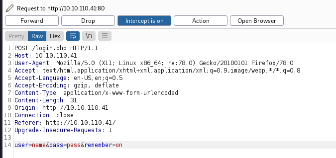
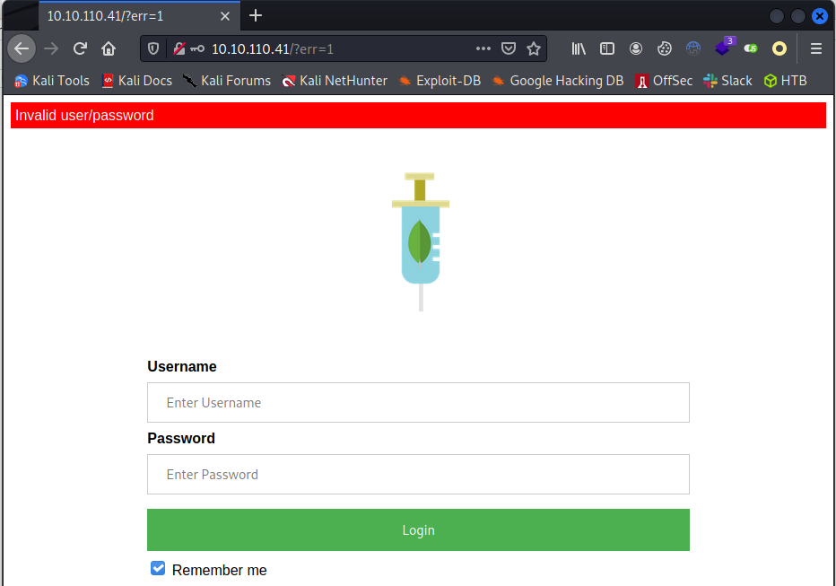
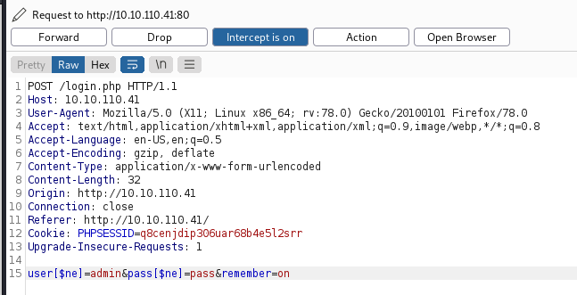
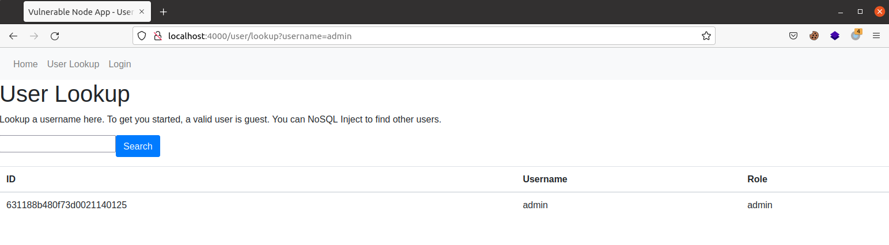
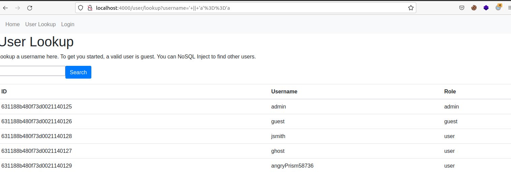
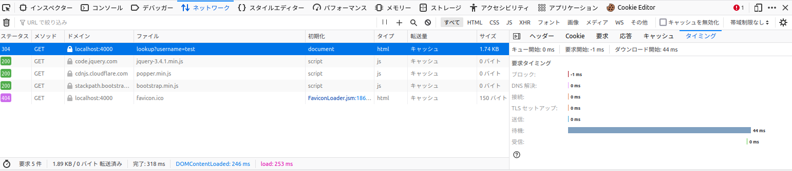
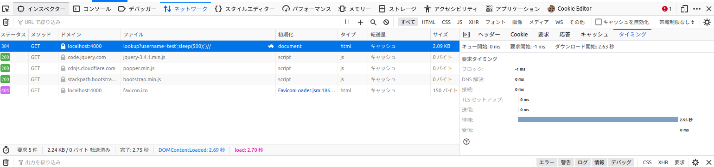

# NoSQL Injectionとは
NoSQLデータベースを利用したWebアプリケーションにおける脆弱性の事です。
No SQLはより柔軟なデータ形式を使用する、SQLを利用しないデータベースシステムを指します。一般的にデータを以下の4つに管理します。
キーバリュー型、列指向型、グラフ型、ドキュメント型の4つです。

# NoSQL Injectionの原因
開発者がユーザ入力を適切にサニタイズ処理、受け取る値のみの正しい取得、これらができていないため発生します。

# NoSQL Injectionが及ぼす影響
攻撃者はクエリパラメータを変更することで、データベースに意図しない挙動をさせることができます(例：CRUD操作)。
また、使用するnosqlの種類によっては任意のJavaScriptを実行される可能性もあります。
よって、アプリケーションの機密性、整合性、可用性を損ないます。

# 事例紹介

## CVE-2021-22911
Rocket Chatで見つかったNoSQLインジェクション
getPasswordPolicy関数で、NoSQLインジェクションが刺さります
認証/認可を必要とせずに、パスワードリセットトークンを流出させることで、アカウントの乗っ取りに利用する事が可能
管理者アカウントを乗っ取ることで、RCEに繋げることも可能  
ref : https://www.cve.org/CVERecord?id=CVE-2021-22911

## CVE-2021-20736
GROWI 日本製のOSSで見つかったNoSQLインジェクション
gitの編集ログを見る感じだと、アクセストークンパーサーにNosqlインジェクションがあった
ref : https://weseek.co.jp/ja/news/2021/06/14/growi-nosql-ingection/
ref : [JVN#95457785](https://jvn.jp/jp/JVN95457785/index.html)

##  CVE-2020-35666
Software : Steedos Low Code DevOps Platformで見つかったNosqlインジェクション  
ポストされるパラメータを、X-User-Id[$ne]=1の様に書き換える事で、インジェクションが通る
ref : https://github.com/steedos/steedos-platform/issues/1245

# 診断観点
## Mongo
### 否定演算子の挿入
否定演算子を挿入することでの検査が可能です。ログインバイパスを例に説明します。  
正常なリクエストは以下の通りで、適当にuser=name, pass=passといった値を入れたので、ログインに失敗してしまいます。  

  

ログインに失敗  

  

このサイトに対して、以下のようなリクエストを投げる  

  

ログインに成功する    

  

MongoDBでは、$neを否定演算子として扱う。この、否定演算子を挿入する。  
PHPなどの言語の仕様である組み込みの連想配列処理が悪用され、以下のような配列に変換される。
```
array("user" => array("$ne" => "admin"), "pass" => array("$ne" => "pass"));
```
上記の値が処理されることで、ユーザー名の部分は user != 'admin' 、パスワードの部分は pass != 'pass' となり、指定した値以外のすべてのユーザーにマッチするのでログインできてしまいます。(指定した値が存在しなかった場合は登録ユーザー全員がマッチする)
### Mongo SSJI
ユーザー検索機能などで、$where演算子を使っており、JSを動かす設定が有効だった場合  
正常なリクエストは以下のような結果になる。  
adminで検索してみると、adminユーザーの情報が返ってくる(?username=admin)  

  

実際に、以下のような攻撃リクエスト(js演算子を)用いてみると、全てのユーザ情報を取得できる(?username='+||+'a'%3D%3D'a) 

  

今度は、JSのsleep関数を実行するリクエストを送信して見る。  
正常な値 test を入れた場合の反応が44ms  

     

そして、以下のようなペイロードを入れた場合 2.25sで動いており、sleep関数が動いている事が確認できる  

```
test'%3Bsleep(500)%3B'}%2F%2F
```



## Redis

### 意図しないデータの挿入
想定していないパラメータが送られてきた時に、正しくパラメータを検証していない事が原因で、意図しないデータが登録されてしまう。

####  Jsonからの受け取りで挿入
```
app.use(bodyParser.json());

app.post('/', function (req, res) {  
    redis.set(req.query.key, "default");
});
```
{key : "foo"}が送られ、redis.set("foo", "default");が実行される事が想定されるが、{key : ["foo", "evil"]}こういったリクエストを送る事で、redis.set(["foo", "evil"], "default"); が実行されてしまい、末尾の "default "の値が削られます。

####  クエリ文字列からの挿入
```
app.post('/', function (req, res) {  
    redis.set(req.query.key, "default");
});
```
通常のリクエスト?key=foo に対して、 redis.set("foo", "default"); が実行されるはずが、?key[]=foo&key[]=evil のようなエクスプロイトを送信すると、以下のようなコードが実行されてしまう。 
```
redis.set(["foo", "evil"], "default");
```
query-stringパラメータを使ったインジェクション攻撃は、JSONで示したものと同様に動作しますが、今回は引数配列を直接注入することはできません。その代わり、広く普及しているqsモジュールを利用することができます。このモジュールは、オブジェクトや配列をパラメータとして渡します。
拡張されたクエリ文字列構文を可能にします。expressのような一般的なフレームワークでは、このモジュールがデフォルトで有効になっています。
このような場合、 ?key[]=foo&key[]=evil は配列に変換され、ドライバーはそれを引数配列として解釈します。その結果、foo=evilがkey-valueペアとして格納され、末尾の "default "の値が削られてしまいます  
ref : [NoSQL Injection > Redis](https://medium.com/@PatrickSpiegel/https-medium-com-patrickspiegel-nosql-injection-redis-25b332d09e58)

# 対策

## MongoDB
- 最新バージョンを使用
- 入力検証・サニタイズライブラリの仕様  
    -  mongo-sanitize、mongoose
- MongoDBにおいては、 where、mapReduce、 group演算子を使用しない。これらの関数は攻撃者が任意のJavaScriptを注入できてしまう。
可能であれば、mongod.confに以下のように設定する。
```
javascriptEnabled:false
```
- 常に最小特権を使用する。アプリケーションが悪用された場合でも、攻撃者が他のリソースにアクセスできないように、可能な限り低い特権でアプリケーションを実行する。

## Redis(意図しないデータの挿入)
こちらの攻撃の対策は、渡されたパラメータを正しく受け取るように実装することが対策となります。  
ref : [NoSQL Injection > Redis. Ever considered injection a problem for… | by Patrick Spiegel | Medium](https://medium.com/@PatrickSpiegel/https-medium-com-patrickspiegel-nosql-injection-redis-25b332d09e58)

# 補足資料
- DynamoDB  
    - [DynamoDB Injection. I have been developing a bunch of… | by Abhay Bhargav | AppSecEngineer | Medium](https://medium.com/appsecengineer/dynamodb-injection-1db99c2454ac)
- couchdb
    - [NOSQL INJECTION](https://owasp.org/www-pdf-archive/GOD16-NOSQL.pdf)
- memcached
    - [The New Page of Injections Book: Memcached Injections](https://www.blackhat.com/docs/us-14/materials/us-14-Novikov-The-New-Page-Of-Injections-Book-Memcached-Injections-WP.pdf)
    - [A small injection for memcached – HackMag](https://hackmag.com/security/a-small-injection-for-memcached/)
- Cassandra
    - [br3akp0int: CASSANDRA AND CQL INJECTIONS](https://br3akp0int.blogspot.com/2019/11/cassandra-and-cql-injections.html)

# 参考資料
- 


# 補助ツール紹介
- [NoSQLi Scanner - PortSwigger](https://portswigger.net/bappstore/605a859f0a814f0cbbdce92bc64233b4)
- [GitHub - codingo/NoSQLMap: Automated NoSQL database enumeration and web application exploitation tool.](https://github.com/codingo/NoSQLMap)
- [GitHub - digininja/nosqlilab: A lab for playing with NoSQL Injection](https://github.com/digininja/nosqlilab)
- ペイロードリスト  
    - [NoSQL injection - HackTricks](https://book.hacktricks.xyz/pentesting-web/nosql-injection)