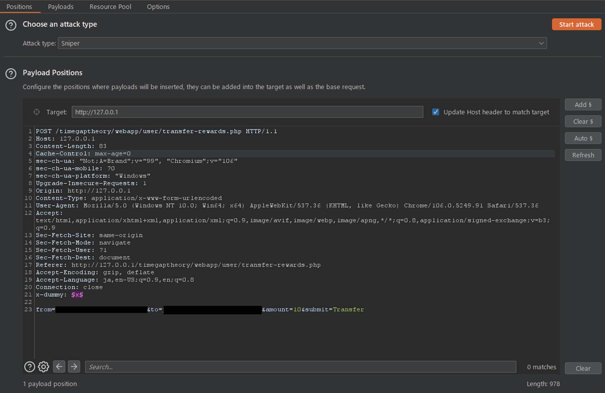
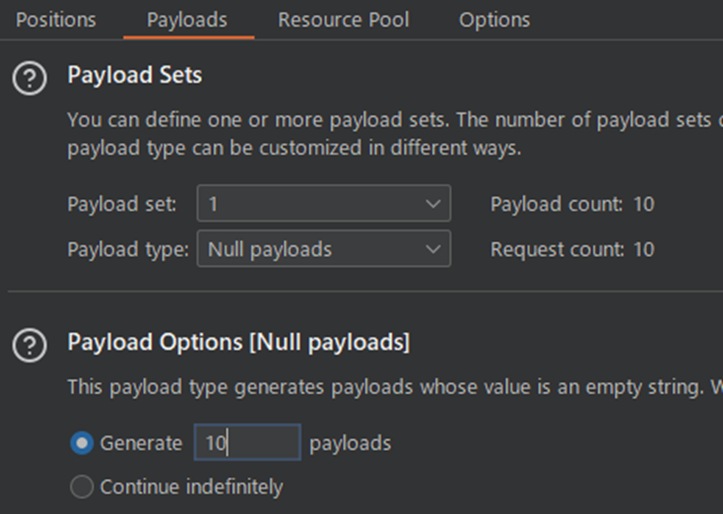
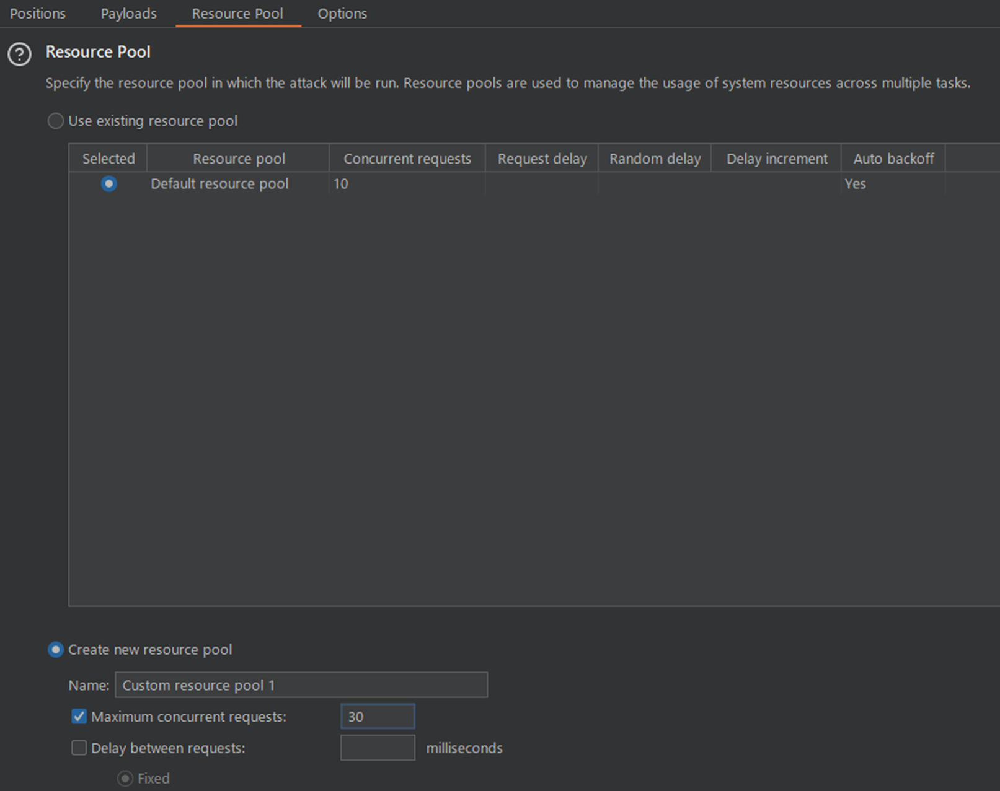
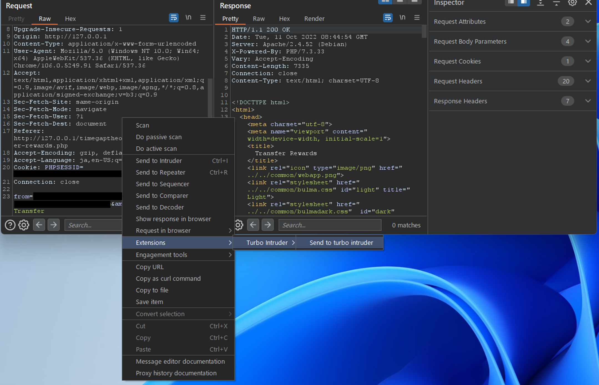
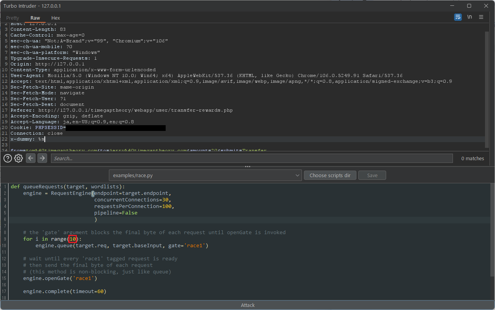

# レースコンディション/TOCTOU
## 概要
システム開発のセキュリティにおいてレースコンディションとTOCTOUは、しばしば混同して使われることがありますが、それぞれの違いについて用語の整理から確認していきましょう。  

レースコンディション(race condition)とは、複数の処理が同じデータに対して同時にアクセスしたときに競合状態になることで、想定外の処理が引き起こされる問題です。  
対してTime Of Check To Time Of Use(TOCTOU)とは、あるデータを使用する際に、データの状態をチェックする処理から実際にそのデータを使用する処理するまでの間に、データの状態が変化してしまうことで想定外の処理が引き起こされる問題です。  

要約すると、レースコンディションは様々な競合状態の問題を表す包括的な脆弱性なのに対し、TOCTOUはより実装の状況を限定した具体的な脆弱性であることが分かります。  

本章では、主にTOCTOUに関連する脆弱性や攻撃手法について説明します。  

## 原因
TOCTOUは主にデータのチェックとそのデータの使用するタイミングが異なっていることに起因しています。    
そのため、TOCTOUを対策する考え方としては、データのチェックと使用を同時に行い、処理の差を発生させないようにすることが理想的です。  

## 影響
代表的な脅威の例として、許可されていないデータへのアクセスや、回数制限などを超えて実行することを許してしまうような影響が考えられますが、データの内容や重要性、アプリケーションの振る舞いなどのビジネスロジックによってTOCTOUによる影響範囲は大きく異なります。  

ここでは、TOCTOUが発生しやすい機能を例にあげます。  

* 送金処理
* クーポンやキャンペーンコード等の発行や使用
* アカウントの新規登録
* 高評価、いいねボタンなどの投票機能

## 診断観点/攻撃手法
一般的に、DASTのようなツールを使用してTOCTOUの脆弱性を特定することは困難です。  
これは、競合状態を引き起こした状態と正常なWebアプリケーションの振る舞いの違いを機械的に判断することは難しいためです。  

また、TOCTOUの検査を行うためにはミリ秒単位で調整されたリクエスト送信や単一のHTTPパイプライン内で複数のHTTPリクエストを送る検査が必要になってくるため、Webアプリケーション診断に特化した専門ツール(Burpなど)が必要になるでしょう。  
このように、競合状態を起こすための条件や環境を整える必要がある性質上、手動によるテストも他のWebアプリケーション脆弱性検査に比べて検査が難しいと考えられています。  

TOCTOUの脆弱性を見つけるためには、データのチェック処理とデータを使用する処理が別のタイミングで行われている箇所を探しましょう。  
具体的には、実行回数に制限があるような機能や重複防止の制限が設けられている機能などでTOCTOUの検査を行うことが有用です。  

### Burp Intruderを使用した検査
Burp Intruderを使用してTOCTOUの検査を確認するパターンを紹介します。Burp IntruderはBurpに搭載されている機能の一つですが、Community Editionには機能制限があるためPro Editionでしか検査が行えません。Community Editionを使用する場合は、後述するTurbo Intruderを使用した検査方法をご覧ください。  

はじめに、送信したいリクエストをBurp Intruderにセットします。  
Burp Intruderを開始するにはペイロードポジションを設定する必要がありますが、ペイロードによる作用を防ぐため、ここではダミー用のリクエストヘッダー(`x-dummy`)を用意し、ダミー用ヘッダーの値にペイロードポジションを設定します。  

次に、ペイロードの設定を行います。  
`Payload Type`を`Null payloads`に設定します。  
Generateの空白欄に送信したいリクエスト数を入力します。  

デフォルトでは同時に10リクエストを送信します。  
より多くのリクエストを送信したい場合は、`Resource Pool`設定から新しいリソースプール設定を作成し、`Maximum concurrent requests`を設定してください。  

### Turbo Intruderを使用した検査
Burp Suiteの拡張機能として公開されているTrubo Intruderを使用したパターンを紹介します。  
Turbo Intruderは、大量のHTTPリクエストを送信したり、Pythonを使用して柔軟にリクエスト前後の処理を操作することができる拡張機能です。  
また、Turbo Intruderは、標準のBurp Intruderとは異なりCommunity Editionでも使用することが可能です。  

{}
注意: Turbo Intruderは、Port Swigger社のセキュリティリサーチャーであるJames Kettle氏によって開発されていますが、十分なテストが行われていないためBurpの標準機能よりも信頼性がなく、システムパフォーマンスに影響を及ぼす可能性があるため、拡張機能を使用される際には自己責任でお願い致します。  
{}

送信したいリクエストを選択し、コンテキストメニューから`Extensions`->`Turbo Intruder`->`Send to turbo intruder`をクリックして、Turbo Intruderへリクエストを送ります。  

別のウィンドウが表示されます。  
Turbo IntruderもBurp Intruderと同様にペイロードポジションを設定する必要があります。ここではダミー用のリクエストヘッダー(`x-dummy`)を用意し、ダミー用ヘッダーの値に%sをセットしてペイロードポジションを設定します。  
次にドロップダウンリストから「`examples/race.py`」を選択します。  
デフォルトでは同時に30リクエスト送信する設定になっています。例として10リクエスト送信したい場合は、9行目の`range`関数の引数を修正します。  

## 事例紹介
* https://github.com/reddelexc/hackerone-reports/blob/master/tops_by_bug_type/TOPRACECONDITION.md

## 対策
データの整合性を保つ設計を行う必要があります。しかしながら、Webアプリケーション毎によって実装やデザインが異なるため、具体的な方法は多岐に分かれます。  

考えられる対策として、データのチェックからデータ更新までの一連の処理が完了するまで、他のスレッドやプロセスからアクセスできないようにしてください。  
データベースで管理している場合はトランザクションを行い、読み書きする情報にロックを掛ける実装にしてください。  
ただし、ロックの範囲が広すぎると脆弱性発生箇所とは異なる箇所でデッドロックが発生したり、トランザクション処理によってパフォーマンスにも影響を及ぼす可能性があるため注意してください。  

## 学習方法/参考文献
* https://timegaptheory.com/index.html
